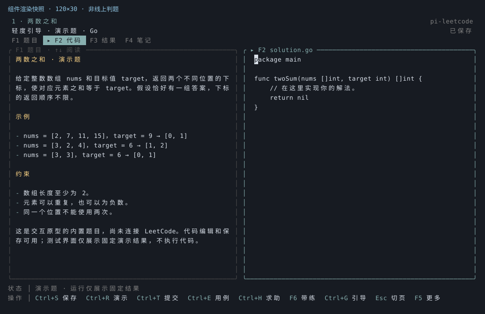
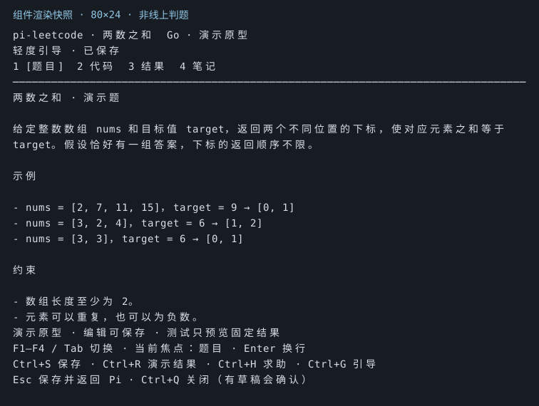

# pi-leetcode

A LeetCode practice and learning workflow for Pi Coding Agent, helping users understand algorithms and solve interview problems independently.

## Status

An interactive prototype is available, tested with Pi 0.87.1. It includes one built-in Two Sum demo in Go, a problem/code workbench, persistent files and notes, three guidance levels, and a handoff to the current Pi agent.

**LeetCode authentication, problem fetching, code execution, and submission are not connected yet.** Test actions show a fixed failure fixture to exercise the results UI. They never execute your code or produce an Accepted verdict.

## Try the prototype

Requires Node.js 22.19+ and Pi 0.87.1. Install the package in Pi:

```bash
pi install git:github.com/MaybeLL/pi-leetcode
```

Restart Pi, or run `/reload` in an existing session, then enter `/leet`. First use creates the default data directory and asks for a workspace location and guidance level. No practice project needs to be created manually.

For development from this checkout:

```bash
npm install
pi -e ./extensions/leetcode.ts --skill ./skills/leetcode-coach
```

Open `/leet`, switch to code with Tab, edit and save, preview a test result, and ask Pi for help. After the answer, `/leet` restores the workbench and editing position. Agent help requires a configured Pi model.

## Workbench

Wide terminals show the problem and code side by side; narrow terminals switch between views. These images are component render snapshots, not screenshots of online judging.





| Key | Action |
| --- | --- |
| F1–F4 or Tab / Shift+Tab | Switch problem, code, results, and notes. |
| Enter in code or notes | Insert a newline. |
| Up / Down, PageUp / PageDown | Navigate the focused content. |
| Ctrl+S | Save code, notes, and reading position. |
| Ctrl+R | Save and preview the fixed test fixture; does not execute code. |
| Ctrl+H | Save, return to Pi, and enter a help request. |
| Ctrl+G | Save and choose a guidance level. |
| Esc | Save and return to Pi. |
| Ctrl+Q | Close; confirm before discarding unsaved drafts. |

The supported minimum viewport is 32×16; 80×24 or larger is recommended. The editor provides basic text editing without IDE completion or language-server integration.

## Data

Default storage is `~/.pi/leetcode/`, separate from the plugin checkout and Pi's startup directory:

```text
settings.json
workspace/
  problems/0001-two-sum/
    problem.md
    solution.go
    cases.json
    notes.md
    practice.json
  records/
cache/
```

Choose a custom workspace during first setup. Set `PI_LEETCODE_HOME` before starting Pi to use another application data directory, useful for isolated trials. Reopening preserves code; stale buffers fail to save when another editor has changed the files. Changing an existing workspace with migration is planned, not implemented.

## Goals

- Bring problem selection, local testing, and submission into Pi.
- Provide an in-Pi workbench for reading problems, editing solutions, inspecting results, and asking the agent for help.
- Create a default practice workspace on first use, with an optional custom directory.
- Use one practice workflow with configurable proactive guidance: independent practice, light guidance, or step-by-step coaching.
- Adapt questions and hints to the learner's current understanding, with light guidance as the default.
- Let users request any depth of help at any guidance level, including a complete explanation.
- Support an agent-driven solve and debug workflow when explicitly requested.
- Keep execution results and trajectories useful for future agent evaluation.

## Prototype commands

| Command | Planned behavior |
| --- | --- |
| `/leet` | Initialize on first use and enter the practice workbench. |
| `/leet pick`, `/leet open 1` | Open the built-in demo; catalog/search are planned. |
| `/leet test` | Show the fixed test fixture, explicitly labeled as not executed. |
| `/leet hint` | Request a limited hint from the current Pi agent. |
| `/leet settings` | Change the proactive guidance level. |
| `/leet leave` | Detach the practice coaching context from the current Pi session. |
| `/leet submit` | Explain that submission is unavailable; nothing is sent. |

There are no separate learning and practice modes. Proactive guidance defaults to light and can be changed in the UI or by asking Pi. A one-off request for help never changes the level. A full practice review UI is planned.

Practice files persist on disk, while the workbench provides the primary reading and editing experience. Users do not need to create a project or open Markdown files manually.

See [the product design](docs/product-design.md) for the agreed workflow, workbench, storage behavior, and guidance rules.

The package bundles a TypeScript extension and a teaching skill. Go is only the demo language; production language support and the preferred LeetCode site remain to be decided.

## Development

```bash
npm run check
npm test
npm run preview
```

Tests use temporary directories and exercise persistence, concurrent edits, Chinese layouts, focus transitions, cursor restoration, and the command-to-agent handoff. `preview` regenerates the component snapshots. Pi loads the TypeScript extension directly; no build is required.

The next step is to try the prototype's interaction, then connect real problem retrieval, execution, and judging. Guidance is conveyed to Pi as instructions; the prototype does not enforce a filesystem sandbox or guarantee a model's compliance with teaching rules.
